# HTTP File Server with TCP Sockets

### Course: Computer Networks

### Author: Belih Dmitrii

---

### Running the Server

```bash
python server.py /path/to/directory 8080
```

### Running the Client

```bash
python client.py http://example.com/image.png ./folder

```

### Docker

```bash
docker-compose up -d

# Stop services
docker-compose down
```

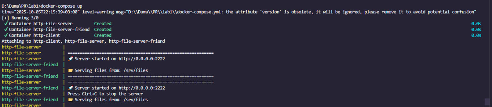
_Server successfully serving files from the specified directory_

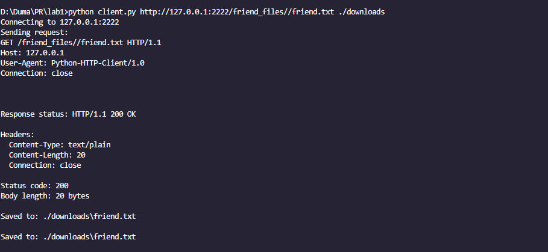

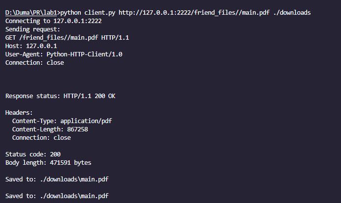
_Client takes successfully serving files from the specified directory_


_UI of server_


_PDF open in server_


_Image+HTML code output that it takes two request one for text is and the second request is for display the image_

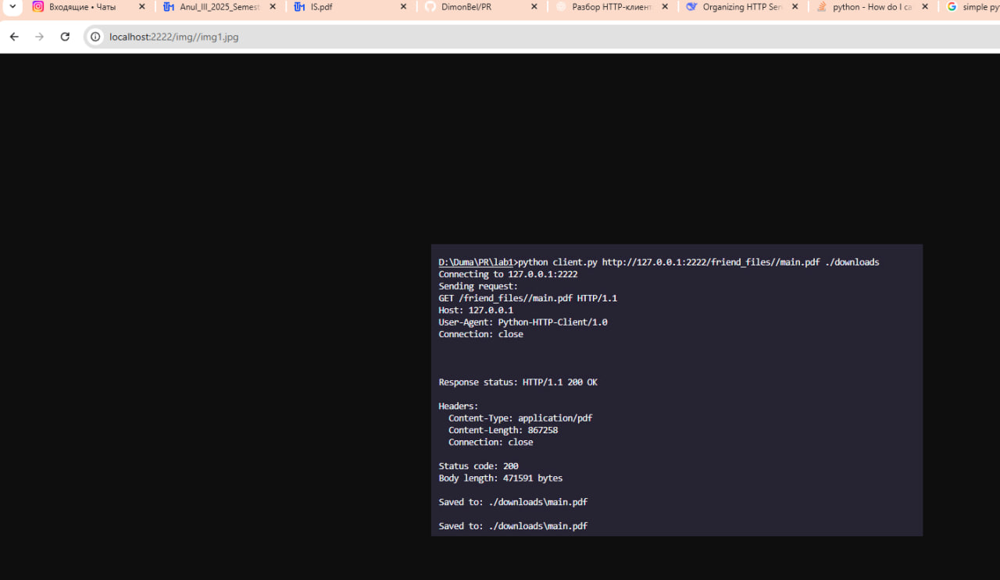
_image open in server_

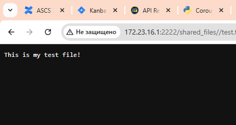

_TXT shows open in server_


_Same internet connection ( from my phone and same WI-FI)_

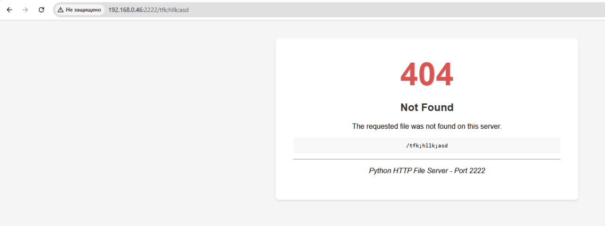

_404 page generate if not this file on my computer folder_

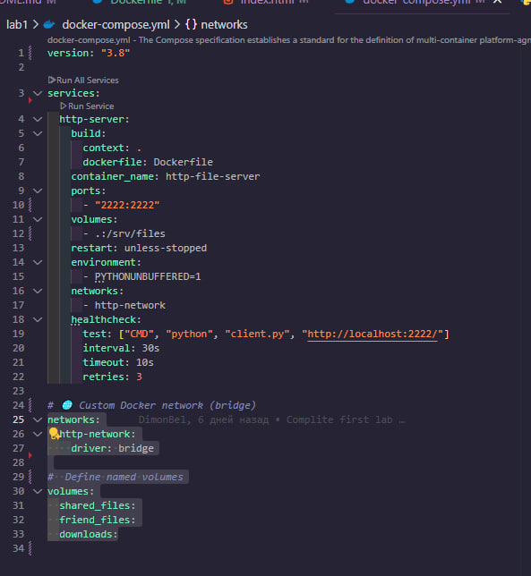

_Here it is how compose looks like helacheck runs the client and chech every 30second if its running or not_

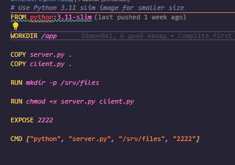

_How I run python in docker file_


_My structure of program_

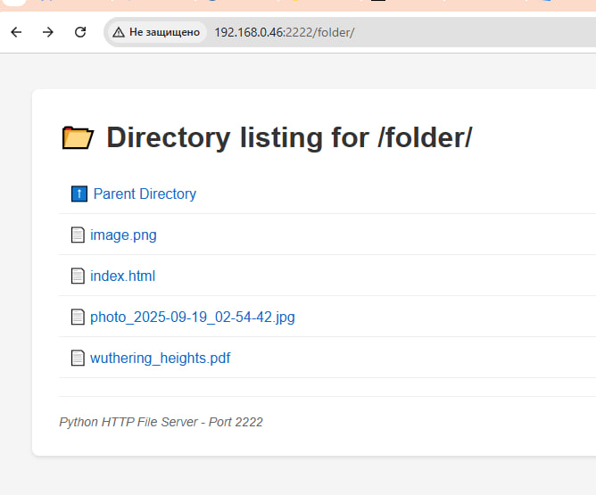

_Opens new folders in html on server_

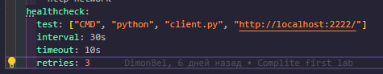
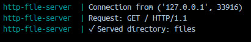

_Here is shows that each 30seconds it runs the client code to check conection inside conainer if it is running or its died_

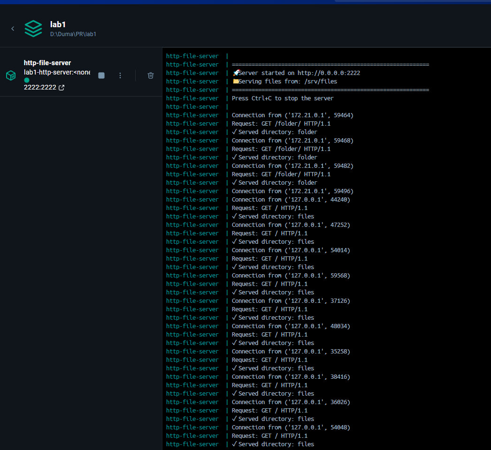
_Here it is shows all logs how it works inside computers_
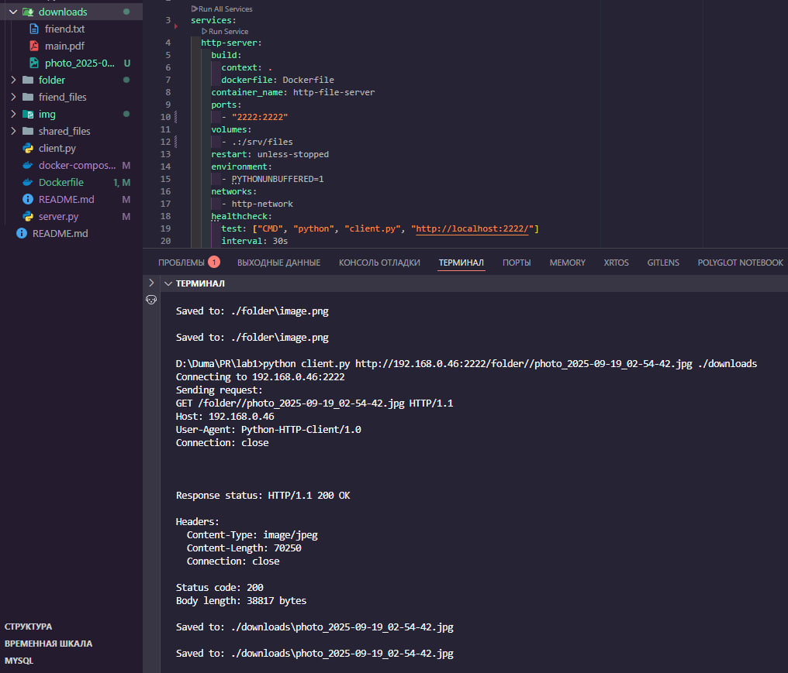

_Here it is how server save with client in my directory takes the file and save on necessary folder_


_Here it is how server save with client in my directory takes the file and save on necessary folder_
