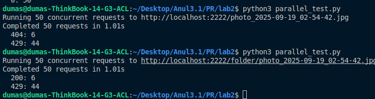
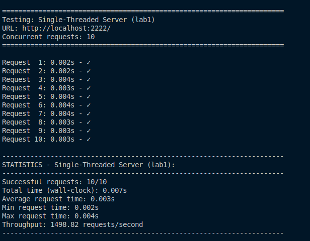
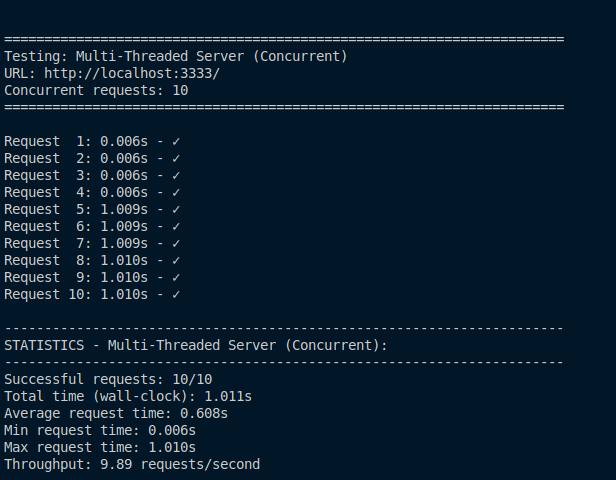
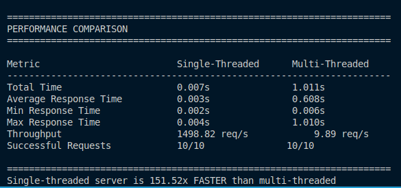

# Concurrent HTTP File Server

### Course: Computer Networks

### Author: Belih Dmitrii

---

### Running the Server


_Server successfully serving files from the specified directory_


_UI of server with count_

"naive" mode (HAS RACE CONDITION)
```
def _increment_count_naive(self, rel_path: str):
    if rel_path not in self._counts:
        self._counts[rel_path] = 0
        time.sleep(0.001)  #Increases race condition probability
    self._counts[rel_path] += 1
```
And NO RACE CONDITION

```
    def _increment_count_locked(self, rel_path: str):
        with self._counts_lock:
            self._counts[rel_path] = self._counts.get(rel_path, 0) + 1
```
Here it is shows how race condition is avoiding because each request from different users is locked 



_How a multiple request per second works_




_How a single request per 10 second works_



_How a multiple request per 10 second works_



_Overall_

Why is much faster single but not concurent:
The Key Problem: Python's GIL + Artificial Delay
Looking at your concurrent server code, I see this critical line:

```python
if self.delay_sec > 0:
    time.sleep(self.delay_sec)
```
Concurrent server has a 1 second delay (DELAY=1.0 by default) that happens before processing each request.


_Demo video_


