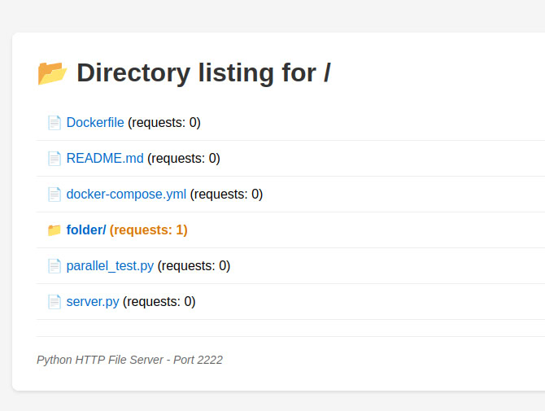

# Concurrent HTTP File Server 

### Course: Computer Networks

### Author: Belih Dmitrii

---

### Running the Server

```bash
python server.py /path/to/directory 8080
```


### Docker

```bash
docker-compose up -d

# Stop services
docker-compose down
```


_Server successfully serving files from the specified directory_



_UI of server with count_


_PDF open in server_


_Image+HTML code output that it takes two request one for text is and the second request is for display the image_


_image open in server_


_TXT shows open in server_


_Same internet connection ( from my phone and same WI-FI)_


_404 page generate if not this file on my computer folder_


_How I run python in docker file_


_How a multiple request per second works_
